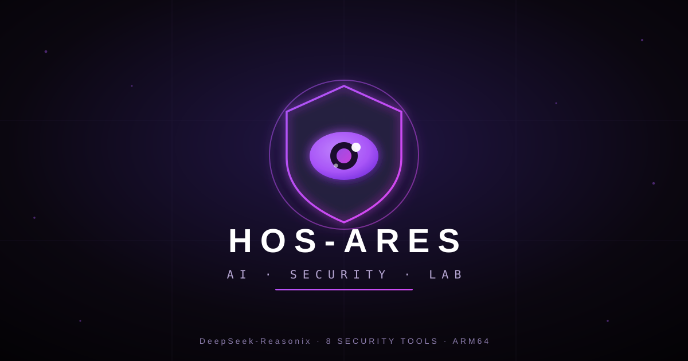

<p align="center">
  
</p>

<p align="center">
  <b>HOS-ARES · AI 安全实验室</b><br/>
  <i>Android 端一体化 AI 安全工具台 —— 手机上的渗透测试作战室</i>
</p>

<p align="center">
  
  
  
  
  
</p>

---

**HOS-ARES** 是一个打包成 Android APK 的 **AI 安全工具台**：以 **DeepSeek-Reasonix 源码构建**的 AI Agent 为核心，在手机上通过 proot 运行完整的 Alpine Linux 环境，**预装 8 个安全工具**（零联网安装、打开即用）。内置"安全风信子"深色交互界面，LLM 统一继承一次配置的 DeepSeek Key。

> ⚠️ **v0.1.0 为早期版本**，未经全面测试，仅供评估与研究用途。

---

## ✨ 核心特性

| | |
| --- | --- |
| 🧠 **AI 核心** | DeepSeek-Reasonix 官方源码构建（linux/arm64） |
| 📦 **零等待开箱** | python3.15 + 39+ wheels + 8 个安全 Agent 全部预装进 rootfs.dat，首次解压即用，无需联网安装 |
| 🔌 **MCP 原生接入** | 5 个 MCP server（Argus/RepoAudit/Strix/Tengu/MCTS）+ 3 个 CLI 工具，reasonix 启动即自动发现 |
| 🎯 **统一多模型** | 所有工具 LLM 统一继承 App 设置页配置，支持 DeepSeek/Claude/OpenAI/Gemini/Local |
| 🔗 **本地 API** | 支持自定义 Base URL，接入 Ollama/vLLM/LiteLLM 等本地部署 |
| 🎨 **安全风信子 UI** | 深紫黑（`#0B0710`）+ 电光紫（`#A855F7`/`#D946EF`）原生界面，Home 启动页 + Root 检测 |
| 🕵️ **能力分级** | frida 类动态分析功能随设备 Root 状态自动启用；不适用项（metasploit/docker）明确禁用，AI 不会误调用 |

## 🧰 预装工具全家桶

| 工具 | 类型 | 能力 | 接入 |
| --- | --- | --- | --- |
| **Argus** | MCP server | AI 红队：500+ 对抗探针（OWASP LLM Top10 / MITRE ATLAS） | `redteam_scan` |
| **PentestGPT** | MCP server | 自动化渗透测试 / CTF 解题 | `run_pentestgpt` |
| **RepoAudit** | MCP server | 仓库级代码审计（NPD/内存泄漏/UAF，C/C++/Java/Python/Go） | `audit_repo` |
| **Strix** | MCP server | AI 编排渗透测试（quick/standard/deep 模式） | 自动发现 |
| **Tengu** | MCP server | AI 编排渗透副驾驶（FastMCP，自动决策下一步） | 自动发现 |
| **MCTS** | MCP server | MCP 工具链威胁扫描（注入/权限/攻击链） | 自动发现 |
| **ghostprobe** | CLI | OWASP MCP Top 10 动态红队探测 | `ghostprobe scan-file` |
| **mitmproxy** | CLI | Burp 平替：HTTP(S) 抓包/拦截/重放/改包 | `mitmdump` |
| **OWASP ZAP** | CLI | Burp 平替：Web 主动扫描/爬虫（headless + REST API） | `zap-daemon` |

> 可选能力：`nmap` / `sqlmap` / `nuclei` 可随时在 reasonix 内 `apk add` / `pip install` 按需安装。

## 🚀 快速开始

```bash
# 1. 安装（仅 arm64，debug 签名）
adb install hos-ares.apk

# 2. 打开 App → 进入 Reasonix 终端 → 首次解压环境（约 1-2 分钟）

# 3. 在「设置」页配置 LLM（只需一次，所有工具自动继承）
#    - 选择 LLM 后端（DeepSeek / Claude / OpenAI / Gemini / Local）
#    - 填入 API Key
#    - 填入自定义 Base URL（可选，支持本地 Ollama/vLLM/LiteLLM 等）
#    - 填入模型名（如 deepseek-v4-flash）
#    - 点击「保存设置」

# 4. 用自然语言指挥
#    "对 https://target.com 做红队测试"
#    "审计 /sdcard/MyApp 找内存泄漏"
#    "抓包分析这个接口"  /  "对目标做主动扫描"
```

## 🔌 本地 API 接入

所有 Agent 统一继承 App 设置页配置的 LLM 参数，无需单独配置。

### 支持的后端

| 后端 | Base URL 示例 | 说明 |
|------|--------------|------|
| **DeepSeek** | `https://api.deepseek.com` | 默认，国产最优 |
| **Anthropic** | `https://api.anthropic.com` | Claude 系列 |
| **OpenAI** | `https://api.openai.com` | GPT 系列 |
| **Gemini** | `https://generativelationship.googleapis.com` | Google 系列 |
| **Local** | `http://localhost:11434/v1` | Ollama / 本地部署 |

### 本地部署配置示例

```
# Ollama（手机需通过 Termux 或 PC 端桥接）
Base URL: http://<PC局域网IP>:11434/v1
模型名: qwen2.5:7b / llama3.1:8b

# vLLM（PC 端部署）
Base URL: http://<PC局域网IP>:8000/v1
模型名: 任意支持的模型

# LiteLLM（统一代理）
Base URL: http://<PC局域网IP>:4000/v1
模型名: 任意已路由模型
```

> ⚠️ 手机 proot 环境内无 GPU，本地 LLM 需在 PC 端运行，手机通过局域网 WiFi 访问。

## 🏗️ 架构

```
┌─────────────────────────────────────────────────────┐
│  HOS-ARES (com.hos.ares)                            │
│   Home 启动页（安全风信子 · Root 检测）              │
│   设置页（LLM 后端/Key/Base URL/模型配置）           │
│   Terminal 页（xterm.js + 自研 JS-Java 桥）          │
├─────────────────────────────────────────────────────┤
│  APK assets (483MB)                                 │
│   ├── rootfs.dat (464MB) — 完整预装环境              │
│   │   ├── python3.15 + 39 wheels（全部预装）         │
│   │   ├── 8 个安全 Agent（MCP / CLI）                │
│   │   └── Alpine Linux 3.20 (arm64)                  │
│   ├── alpine-minirootfs.tar (8.7MB fallback)         │
│   └── proot + bootstrap.sh                          │
├─────────────────────────────────────────────────────┤
│  LLM 后端（统一配置，支持多提供商）                   │
│   DeepSeek / Claude / OpenAI / Gemini / Local       │
│   Base URL 可自定义 → 适配 Ollama/vLLM/LiteLLM      │
└─────────────────────────────────────────────────────┘
```

## 🛠️ 从源码构建

仓库仅含源码；构建必需的大体积编译产物（`rootfs.tar` 435MB、`reasonix`、`pty-bridge`）从 **[GitHub Releases](https://github.com/lxcxjxhx/HOS-ARES/releases)** 下载放回：

```
app/app/src/main/assets/rootfs.tar
app/app/src/main/assets/usr/bin/reasonix
app/app/src/main/assets/usr/bin/pty-bridge
```

reasonix / pty-bridge 也可从源码构建（见 `app/app/src/main/native/pty-bridge.go` 与 [esengine/DeepSeek-Reasonix](https://github.com/esengine/DeepSeek-Reasonix)）。

```bat
cd app
set JAVA_HOME=C:\path\to\jdk-17
call gradlew.bat assembleDebug
```

要求：JDK 17+、Android SDK（platform-34 / build-tools 34.0.0）。

## 📦 Release 资产

| 资产 | 说明 |
| --- | --- |
| `hos-ares.apk` | 完整 APK（**自包含**，内含 rootfs.tar + reasonix + pty-bridge，安装即用） |
| `rootfs.tar` | 预装环境（构建/升级用） |
| `reasonix` | DeepSeek-Reasonix 源码构建二进制 |
| `pty-bridge` | Go 自研终端桥 |

## 🛡️ 合规声明

- 请仅在**获得明确授权**的目标上使用安全工具；本项目不对任何未授权使用负责。
- 预装工具均为开源项目（MIT / Apache-2.0 / GPL），各自的许可见对应上游仓库。
- proot/loader 为 GPL 开源组件（[proot-me/proot](https://github.com/proot-me/proot) v5.4.0 构建产物）。

## 🗺️ 已知限制（v0.3.0）

- proot 组件为官方开源构建产物（自编译需 zig，见 `scripts/rebuild_rootfs.py`）
- 不适用手机 proot 的未集成：metasploit / docker / frida（frida 需设备 Root）
- ollama 未预装（体积过大）；但通过「Local」后端可接入 PC 端 Ollama/vLLM
- 首次启动解压约 1-2 分钟；APK 约 483MB（预装环境的体积代价）
- Python wheels 仅包含安全工具运行所需的最小集合；额外工具可 `pip install` 联网补充

## 📄 许可

本项目代码遵循 **Apache-2.0**；上游工具遵循各自许可证（详见各工具仓库）。
